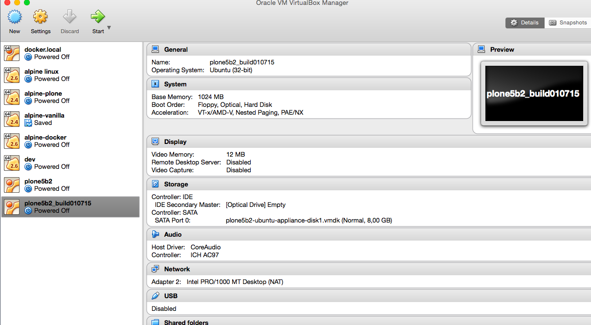

======
Setup
======

Requirements
=============

Please make sure that you have :term:`VirtualBox` installed on your computer.

In case you do not have it installed yet, please `download <https://www.virtualbox.org/wiki/Downloads>`_ VirtualBox for your Operating System.

Getting the Appliance
======================

Browse to `dist.plone.org/vm <http://dist.tiramisu.solutions/virtualbox/>`_ and click on plone5b3_build250715.ova to download it.

Importing the Appliance
=======================

Depending on your Operating System, please follow one of the manuals bellow. If you want to knew more about certain versions, please see :ref:`os-reference-label`

:doc:`Importing into Virtualbox on Ubuntu <ubuntu>`

:doc:`Importing into Virtualbox on Mac OS X <osx>`

:doc:`Importing into Virtualbox on Windows <windows>`

.. toctree::
   :hidden:

   ubuntu
   osx
   windows

Starting the Appliance
======================

Choose the Appliance, click on start and hopefully the fresh imported image will boot.

.. note:: The name of the Appliance may differ, depending on the version

Wait till you see a login screen, that means the Appliance is booted and ready.
