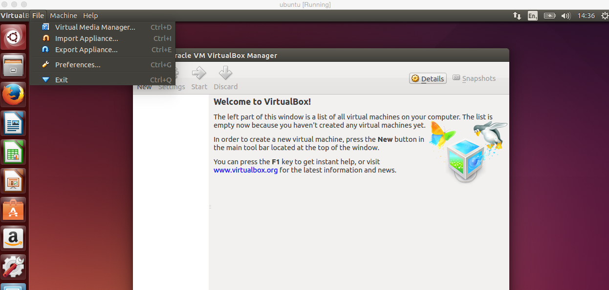
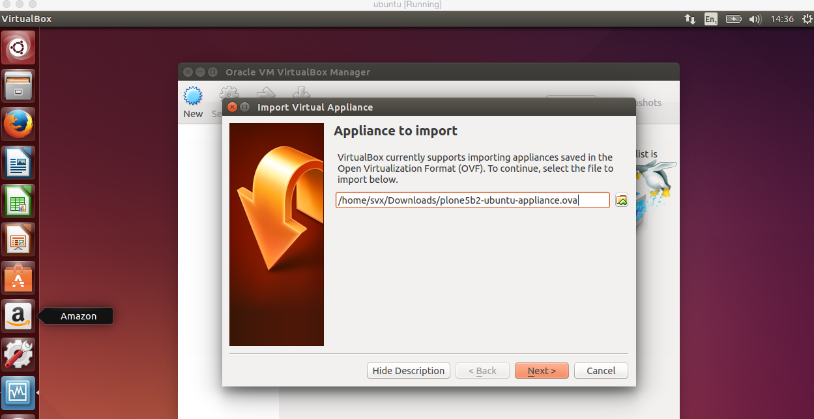
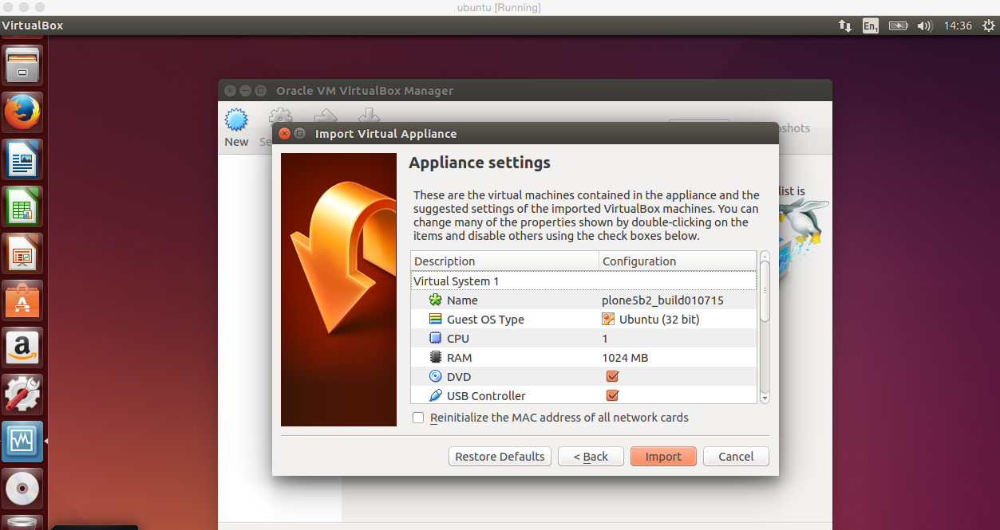
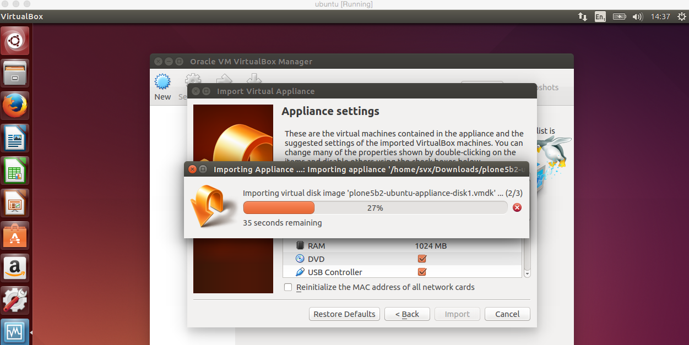

======
Ubuntu
======

Import Appliance
----------------

Lets import the image, click on ``File** -> Import Appliance``

Click ``Open appliance`` and navigate to the already downloaded and image

Click ``Continue``

Click ``Import``

Wait till import is done

