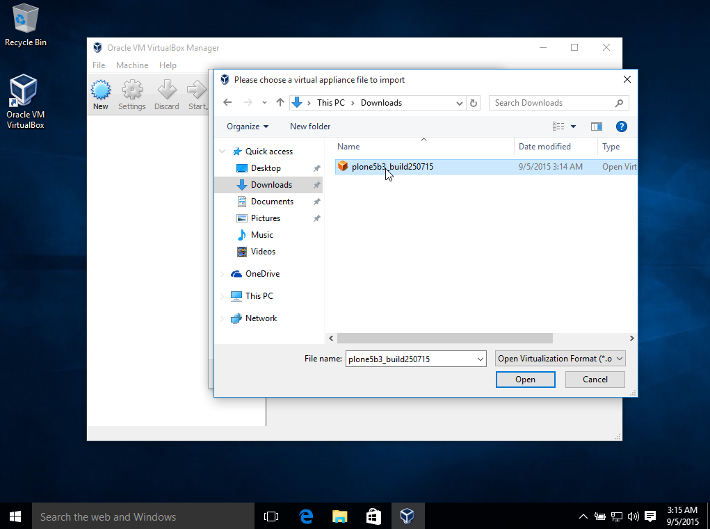

=======
Windows
=======

If you do not have `Virtualbox <https://www.virtualbox.org>`_ installed, please `download <https://www.virtualbox.org/wiki/Downloads>`_ VirtualBox for Windows hosts.

Once downloaded, double-click on the installer which will guide you through the installation. Depending on your version of Windows, you will be asked for permission to install non-Windows signed drivers, which are needed to complete the installation.

Import Appliance
----------------

.. image:: ../_static/import_appliance-win1.png
   :alt: Importing Appliance Picture 1
   :align: center

To import the appliance, click on ``File -> Import Appliance``

.. image:: ../_static/plone-appliance-win_import2.png
   :alt: Importing Appliance Picture 2
   :align: center

Navigate to the already downloaded and appliance

Choose appliance and click ``Open``

.. image:: ../_static/plone-appliance-win-import4.png
   :alt: Importing Appliance Picture 4
   :align: center

Click ``Next``

Click ``Import``

Wait till import is finished

Choose image on the left by clicking on it, click on ``Start``

Wait till you see the login prompt

Now open your browser and browse to http://localhost:8080/Plone and you can start using :term:`Plone`